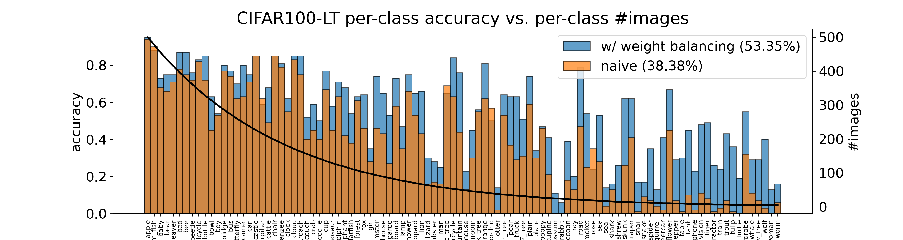

# Long-Tailed Recognition via Weight Balancing
[](https://paperswithcode.com/sota/long-tail-learning-on-cifar-100-lt-r-100?p=long-tailed-recognition-via-weight-balancing)



In the real open world, data tends to follow long-tailed class distributions, motivating the well-studied long-tailed recognition (LTR) problem. Naive training produces models that are biased toward common classes in terms of higher accuracy. The key to addressing LTR is to balance various aspects including data distribution, training losses, and gradients in learning. We explore an orthogonal direction, {\bf weight balancing}, motivated by the empirical observation that the naively trained classifier has "artificially" larger weights in norm for common classes (because there exists abundant data to train them, unlike the rare classes). We investigate three techniques to balance weights, L2-normalization, weight decay, and MaxNorm. We first point out that L2-normalization "perfectly" balances per-class weights to be unit norm, but such a hard constraint might prevent classes from learning better classifiers. In contrast, weight decay penalizes larger weights more heavily and so learns small balanced weights; the MaxNorm constraint encourages growing small weights within a norm ball but caps all the weights by the radius. Our extensive study shows that both help learn balanced weights and greatly improve the LTR accuracy. Surprisingly, weight decay, although underexplored in LTR, significantly improves over prior work. Therefore, we adopt a two-stage training paradigm and propose a simple approach to LTR: (1) learning features using the cross-entropy loss by tuning weight decay, and (2) learning classifiers using class-balanced loss by tuning weight decay and MaxNorm. Our approach achieves the state-of-the-art accuracy on five standard benchmarks, serving as a future baseline for long-tailed recognition.


## Code Description

This folder contains two executable Jupyter Notebook files for demonstrating our training approach and how we will open-source our code. The Jupyter Notebook files are sufficiently self-explanatory with detailed comments, and displayed output. The files reproduce the results on the CIFAR100-LT (imbalance factor 100) as shown in Table 1 of the paper.

Running the files requires some common packages (e.g., PyTorch as detailed later). If running, please start with the first stage training demo before running the second stage training.

1. **demo1_first-stage-training.ipynb** <br>  Running this file will train a naive network using cross-entropy loss and stochastic gradient descent (SGD) *without* weight decay. It should achieve an overall accracy ~39% on the CIFAR100-LT (imbalance factor 100). Then it will train another network *with* weight decay. Running this file takes ~2 hour with a GPU (e.g. NVIDIA GeForce RTX 3090 in our work). The runtime can be reduced by chaning ``` total_epoch_num ``` to ```100```. The training results and model paramters will be saved at exp/demo_1.


2. **demo2_second-stage-training.ipynb** <br> 
    Running this file will compare various regularizers used in the second-stage training such as L2 normalization, $\tau$-normalization, and MaxNorm with weight decay. The latter should achieve an overall accuracy >52\%. Running this file takes a few minutes on a GPU.


## Why Jupyter Notebook?
We prefer to release the code using Jupyter Notebook (https://jupyter.org) because it allows for interactive demonstration for education purposes.

We also provide python scripts in case readers would like run them rather than Jupyter Notebook. These python scripts are converted using Jupyter command below:
 - ``` jupyter nbconvert --to script demo1_first-stage-training.ipynb ```

 - ``` jupyter nbconvert --to script demo2_second-stage-training.ipynb ```


## Requirement
We installed python and most packages through Anaconda. Some others might not be installed by default, such as pandas, torchvision, and PyTorch. We suggest installing them before running our code. Below are the versions of python and PyTorch used in our work. 

 - Python version: 3.7.4 [GCC 7.3.0]
 - PyTorch verion: 1.7.1

We suggest assigning 300MB space to run all the demos, because they will save models paramters.

If you find our model/method/dataset useful, please cite our work:

    @inproceedings{LTRweightbalancing,
      title={Long-Tailed Recognition via Weight Balancing},
      author={Alshammari, Shaden and Wang, Yuxiong and Ramanan, Deva and Kong, Shu},
      booktitle={CVPR},
      year={2022}
    }
